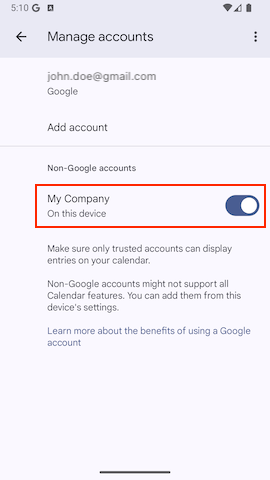

## 📆 Eventide

[](https://pub.dev/packages/eventide) [](https://opensource.org/licenses/MIT) [](https://github.com/sncf-connect-tech/eventide/actions/workflows/ci.yml) [](https://codecov.io/gh/sncf-connect-tech/eventide)

Eventide provides a easy-to-use flutter interface to access & modify native device calendars (iOS & Android).

---

## 📋 Table of Contents

- [Features](#-features)
- [Getting Started](#-getting-started)
- [Quick Start](#-quick-start)
- [API Reference](#-api-reference)
  - [Calendars](#calendars)
  - [Events](#events)
  - [Reminders](#reminders)
  - [Attendees](#attendees)
  - [Accounts](#accounts)
- [Platform-Specific Features](#-platform-specific-features)
- [Exception Handling](#-exception-handling)
- [License](#license)
- [Feedback](#feedback)

---

## 🔥 Features

|    | Eventide |
---- | --------------------------------
:white_check_mark: | Automatic permission handling
:white_check_mark: | Create/retrieve/delete calendars
:white_check_mark: | Create/retrieve/delete events
:white_check_mark: | Create/delete reminders
:white_check_mark: | Custom exceptions
:construction: | Recurring events
:white_check_mark: | Attendees
:construction: | Streams

> **Note:** Eventide handles timezones as UTC. Make sure the right data is fed to the plugin with a [timezone aware DateTime class](https://pub.dev/packages/timezone).

---

## 🔨 Getting Started

### Platform Setup

#### Android

Nothing to add on your side. All permissions are already declared in eventide's `AndroidManifest.xml`

#### iOS

The following are the lines you need to add to your `info.plist` file:

##### Versions below iOS 17
```xml
<key>NSCalendarsUsageDescription</key>
<string>We need access to your calendar to add information about your trip.</string>
```
Starting iOS 17+, it depends whether you want full or write-only access from your user.

##### Write-only
```xml
<key>NSCalendarsWriteOnlyAccessUsageDescription</key>
<string>We need access to your calendar to add information about your trip.</string>
```

##### Full access
```xml
<key>NSCalendarsFullAccessUsageDescription</key>
<string>We need access to your calendar to add information about your trip.</string>
```

Note that write-only AND full access will result on your app asking for both.

---

## 🚀 Quick Start

```dart
import 'package:eventide/eventide.dart';

final eventide = Eventide();

// Create a calendar
final calendar = await eventide.createCalendar(
  title: 'Work',
  color: Colors.red,
  localAccountName: "My Company",
);

// Create an event in a specific calendar with reminders
final event = await eventide.createEvent(
  calendarId: calendar.id,
  title: 'Meeting',
  startDate: DateTime.now(),
  endDate: DateTime.now().add(Duration(hours: 1)),
  reminders: [
    const Duration(hours: 1),
    const Duration(minutes: 15),
  ],
);

// Create an event in the default calendar (iOS write-only access)
await eventide.createEventInDefaultCalendar(
  title: 'Important Meeting',
  startDate: DateTime.now().add(Duration(days: 1)),
  endDate: DateTime.now().add(Duration(days: 1, hours: 1)),
  reminders: [
    const Duration(minutes: 15),
  ],
);

// Delete a reminder
final updatedEvent = await eventide.deleteReminder(
  durationBeforeEvent: Duration(minutes: 15),
  eventId: event.id,
);
```

You can find more examples in the [example app](./example).

---

## 📚 API Reference

### Calendars

#### Create Calendar

```dart
Future<ETCalendar> createCalendar({
  required String title,
  required Color color,
  required String localAccountName,
})
```

Creates a new calendar with the specified title, color, and account name.

```dart
final calendar = await eventide.createCalendar(
  title: 'Personal',
  color: Colors.blue,
  localAccountName: 'My App',
);
```

#### Retrieve Calendars

```dart
Future<List<ETCalendar>> retrieveCalendars({
  bool onlyWritableCalendars = true,
  String? fromLocalAccountName,
})
```

Retrieves a list of calendars, optionally filtered by account name and writability.

```dart
// Get all writable calendars
final calendars = await eventide.retrieveCalendars();

// Get calendars from specific account
final myCalendars = await eventide.retrieveCalendars(
  fromLocalAccountName: 'My App',
);
```

#### Delete Calendar

```dart
Future<void> deleteCalendar({
  required String calendarId,
})
```

Deletes a calendar by its ID.

```dart
await eventide.deleteCalendar(calendarId: calendar.id);
```

### Events

#### Create Event

```dart
Future<ETEvent> createEvent({
  required String calendarId,
  required String title,
  required DateTime startDate,
  required DateTime endDate,
  bool isAllDay = false,
  String? description,
  String? url,
  List<Duration>? reminders,
})
```

Creates a new event in the specified calendar.

```dart
final event = await eventide.createEvent(
  calendarId: calendar.id,
  title: 'Team Meeting',
  startDate: DateTime.now(),
  endDate: DateTime.now().add(Duration(hours: 1)),
  description: 'Weekly team sync',
  isAllDay: false,
  reminders: [Duration(minutes: 15)],
);
```

#### Create Event in Default Calendar

```dart
Future<void> createEventInDefaultCalendar({
  required String title,
  required DateTime startDate,
  required DateTime endDate,
  bool isAllDay = false,
  String? description,
  String? url,
  List<Duration>? reminders,
})
```

Creates a new event in the default calendar. On iOS, this method will prompt the user for write-only permission and insert the event in the user's default calendar.

```dart
await eventide.createEventInDefaultCalendar(
  title: 'Important Meeting',
  startDate: DateTime.now().add(Duration(days: 1)),
  endDate: DateTime.now().add(Duration(days: 1, hours: 1)),
  description: 'Weekly team sync',
  isAllDay: false,
  reminders: [Duration(minutes: 15)],
);
```

#### Retrieve Events

```dart
Future<List<ETEvent>> retrieveEvents({
  required String calendarId,
  DateTime? startDate,
  DateTime? endDate,
})
```

Retrieves events from a calendar within the specified date range.

```dart
final events = await eventide.retrieveEvents(
  calendarId: calendar.id,
  startDate: DateTime.now().subtract(Duration(days: 7)),
  endDate: DateTime.now().add(Duration(days: 7)),
);
```

#### Delete Event

```dart
Future<void> deleteEvent({
  required String eventId,
})
```

Deletes an event by its ID.

```dart
await eventide.deleteEvent(eventId: event.id);
```

### Reminders

#### Create Reminder

```dart
Future<ETEvent> createReminder({
  required String eventId,
  required Duration durationBeforeEvent,
})
```

Adds a reminder to an existing event.

```dart
final updatedEvent = await eventide.createReminder(
  eventId: event.id,
  durationBeforeEvent: Duration(minutes: 30),
);
```

#### Delete Reminder

```dart
Future<ETEvent> deleteReminder({
  required String eventId,
  required Duration durationBeforeEvent,
})
```

Removes a specific reminder from an event.

```dart
final updatedEvent = await eventide.deleteReminder(
  eventId: event.id,
  durationBeforeEvent: Duration(minutes: 30),
);
```

> **Note:** Reminders with durations in seconds are not supported on Android due to API limitations.

### Attendees

⚠️ **Platform Limitation:** Attendee creation and deletion are only supported on Android due to iOS EventKit API restrictions. However, attendees can be retrieved on both platforms.

#### Create Attendee (Android Only)

```dart
Future<ETEvent> createAttendee({
  required String eventId,
  required String name,
  required String email,
  required ETAttendeeType type,
})
```

Adds an attendee to an event.

```dart
final eventWithAttendee = await eventide.createAttendee(
  eventId: event.id,
  name: 'John Doe',
  email: 'john.doe@gmail.com',
  type: ETAttendeeType.requiredPerson,
);
```

#### Delete Attendee (Android Only)

```dart
Future<ETEvent> deleteAttendee({
  required String eventId,
  required ETAttendee attendee,
})
```

Removes an attendee from an event.

```dart
final eventWithoutAttendee = await eventide.deleteAttendee(
  eventId: event.id,
  attendee: eventWithAttendee.attendees.first,
);
```

#### Attendee Types

Available `ETAttendeeType` values:

- `ETAttendeeType.unknown`
- `ETAttendeeType.requiredPerson`
- `ETAttendeeType.optionalPerson`
- `ETAttendeeType.resource`
- `ETAttendeeType.organizer`

##### Platform Mapping Tables

###### Common attendees types mapping
iOS and Android attendee APIs are quite different and thus required some conversion logic. Here's the mapping table that eventide currently supports:

|  ETAttendeeType            | iOS (EKParticipantType)   | iOS (EKParticipantRole)   | Android (ATTENDEE_TYPE)   | Android (ATTENDEE_RELATIONSHIP)   |
|  :------------------------ | :------------------------ | :------------------------ | :------------------------ | :-------------------------------- |
|  unknown                   | unknown                   | unknown                   | TYPE_NONE                 | RELATIONSHIP_NONE                 |
|  requiredPerson            | person                    | required                  | TYPE_REQUIRED             | RELATIONSHIP_ATTENDEE             |
|  optionalPerson            | person                    | optional                  | TYPE_OPTIONAL             | RELATIONSHIP_ATTENDEE             |
|  resource                  | resource                  | required                  | TYPE_RESOURCE             | RELATIONSHIP_ATTENDEE             |
|  organizer                 | person                    | chair                     | TYPE_REQUIRED             | RELATIONSHIP_ORGANIZER            |

###### Platform specific attendees types mapping
Platform specific values will be treated as follow when fetched from existing system calendar:

| ETAttendeeType            | iOS (EKParticipantType)   | iOS (EKParticipantRole)   | Android (ATTENDEE_TYPE)   | Android (ATTENDEE_RELATIONSHIP)   |
| :------------------------ | :------------------------ | :------------------------ | :------------------------ | :-------------------------------- |
| optionalPerson            | person                    | nonParticipant            |                           |                                   |
| resource                  | group                     | required                  |                           |                                   |
| resource                  | room                      | required                  |                           |                                   |
| requiredPerson            |                           |                           | TYPE_REQUIRED             | RELATIONSHIP_PERFORMER            |
| requiredPerson            |                           |                           | TYPE_REQUIRED             | RELATIONSHIP_SPEAKER              |

### Accounts

A calendar belongs to an account, such as a Google account or a local on-device account. You must provide a `localAccountName` when creating a calendar with Eventide.

#### Creating Calendars with Accounts

```dart
const myAppCalendarIdentifier = "My Company";

await eventide.createCalendar(
  title: 'Personal',
  color: Colors.blue,
  localAccountName: myAppCalendarIdentifier,
);

await eventide.createCalendar(
  title: 'Work',
  color: Colors.red,
  localAccountName: myAppCalendarIdentifier,
);
```

#### Filtering by Account

```dart
final myCompanyCalendars = await eventide.retrieveCalendars(
  onlyWritableCalendars: true,
  fromLocalAccountName: myAppCalendarIdentifier,
);
```

> **Note:** Users might need to allow your custom account in their calendar app to display your calendars & events.



---

## 🔧 Platform-Specific Features

### iOS Write-Only Access

As of iOS 17, Apple introduced a new write-only access permission for calendar data, providing users with more granular control over app permissions. This feature allows apps to add events to calendars without being able to read existing calendar data.

#### How it works

When you call `createEventInDefaultCalendar()` on iOS 17+, the system will prompt the user for write-only access if full access hasn't been granted. This method directly creates an event in the user's default calendar without requiring you to retrieve the calendar first.

```dart
// Will prompt user for write only access on iOS 17+
await eventide.createEventInDefaultCalendar(
  title: 'New Meeting',
  startDate: DateTime.now(),
  endDate: DateTime.now().add(Duration(hours: 1)),
  description: 'Weekly team sync',
  reminders: [Duration(minutes: 15)],
);

print('Event created: ${event.title}');
```

#### Important limitations

⚠️ **Key restrictions when using write-only access:**

- **No reading capabilities**: You cannot retrieve events from calendars when using write-only access
- **Create only**: You can only create new events, not modify or read existing ones
- **No calendar enumeration**: You cannot list or retrieve calendar information

```dart
// ❌ This will fail with write-only access
try {
  final calendars = await eventide.retrieveCalendars();
  final events = await eventide.retrieveEvents(
    calendarId: calendars.first.id,
  );
} catch (e) {
  // Will throw ETPermissionException on iOS with write-only access
  print('Cannot read calendars/events with write-only access: $e');
}

// ✅ This works with write-only access
await eventide.createEventInDefaultCalendar(
  title: 'Team Meeting',
  startDate: DateTime.now().add(Duration(days: 1)),
  endDate: DateTime.now().add(Duration(days: 1, hours: 1)),
  description: 'Weekly team sync',
  reminders: [Duration(minutes: 15)],
);
```

#### Permission handling

The system will automatically handle the permission flow:

1. First call to `createEventInDefaultCalendar()` → Shows write-only permission prompt
2. User grants write-only access → Creates event in default calendar
3. User denies access → Throws `ETPermissionException`

#### Best practices

- Handle `ETPermissionException` when attempting operations that require read access
- Consider offering full calendar access for apps that need to read existing events
- Use write-only access for apps that only need to add events (like booking confirmations, reminders, etc.)
- Use `createEventInDefaultCalendar()` for simple event creation without calendar management

---

## ⚠️ Exception Handling

Eventide provides custom exceptions for better error handling:

### Exception Types

- **`ETPermissionException`**: User denied calendar permissions
- **`ETNotFoundException`**: Calendar or event not found
- **`ETNotEditableException`**: Calendar is not editable
- **`ETGenericException`**: General errors during operations

### Example Usage

```dart
try {
  final calendar = await eventide.createCalendar(
    title: 'My Calendar',
    color: Colors.blue,
    localAccountName: 'My App',
  );
} on ETPermissionException catch (e) {
  print('Permission denied: ${e.message}');
} on ETGenericException catch (e) {
  print('Error creating calendar: ${e.message}');
} catch (e) {
  print('Unexpected error: $e');
}
```

---

## License

Copyright © 2025 SNCF Connect & Tech. This project is licensed under the MIT License - see the LICENSE file for details.

## Feedback

Please file any issues, bugs or feature requests as an issue on the [Github page](https://github.com/sncf-connect-tech/eventide/issues).
